www.d-tide-erasmus.com 

За основу сайта проекта взять дизайн сайта МВШМ - <https://ism.edu.kg/>  цветовая гамма должна сочетаться с логотипами проекта и ЕС

Дизайн сайта должен отражать принципы цифровизации, инноваций, гуманитарности, академичности.

Адаптивность под мобильные устройства обязательна.

Фото и визуал размещаются в едином стиле. Поиск по сайту.

`         `**Главная             О проекте             Консорциум             Рабочие пакеты              Публикации            Новости**       KG|RU|ENG
**\
`   `На англ                  **Home         About the Project      Consortium             Work Packages                 Publications               News**

**D-TIDE-KG — Digital Transformation of Doctoral Education Kyrgyzstan**   

(главный слайдер- видео контент, на видео написать название проекта

**Новостной блок (шрифт и оформление оставить как здесь)**

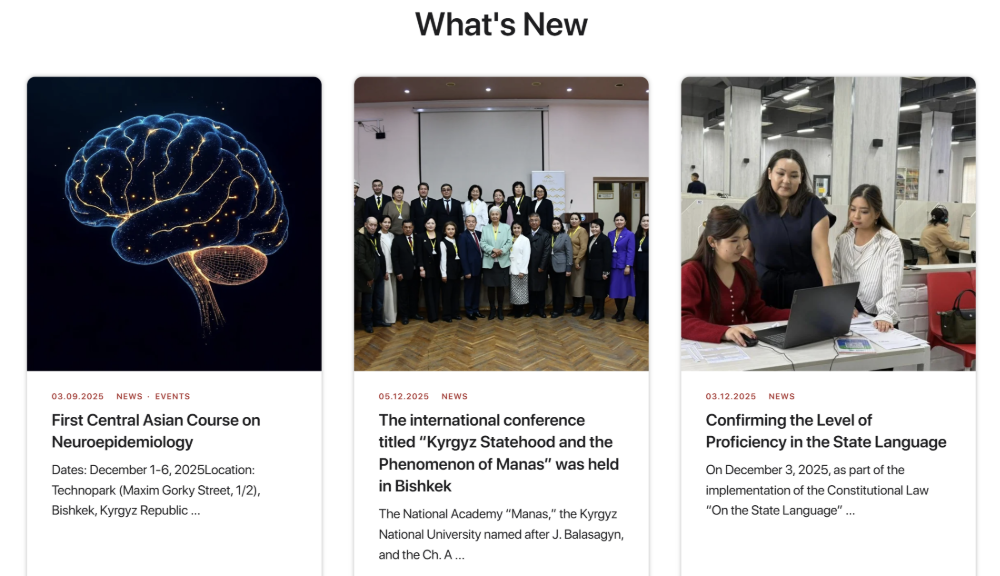

**Цель проекта** 

1. Обеспечение справедливого и качественного докторского образования с применением цифровых технологий по всей территории Кыргызской Республики.
1. Трансформацию PhD-образования через цифровизацию программ, повышение доступности и снижение региональных дисбалансов.
1. Расширение возможностей регионов, включая малообслуживаемые территории.
1. Гармонизацию докторских программ со стандартами Европейского пространства высшего образования (EHEA) и Болонского процесса.
1. Развитие кадрового потенциала вузов и научных организаций.
1. Укрепление партнёрства Кыргызстан–Европа, продвижение совместных инициатив и обмена знаниями.
1. Интеграцию цифровых PhD-подходов в государственную политику.

**Задачи проекта:**

1. Цифровая трансформация PhD-образования:\
   разработка ИТ-платформы и цифровых PhD-куррикулумов.
1. Гармонизация программ:\
   адаптация к стандартам EHEA и Болонского процесса, повышение международной сопоставимости.
1. Развитие человеческого потенциала:\
   обучение 100 сотрудников — академического и административного состава.
1. 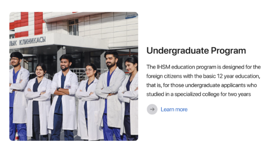Содействие партнёрству:\
   укрепление международного сотрудничества между европейскими и кыргызскими университетами.
1. Укрепление управленческих механизмов:\
   интеграция цифровых PhD-подходов в национальные документы, улучшение нормативной базы.

**Партнёры проекта: логотипы партнеров виде бегущей строки**

1. Министерство науки, высшего образования и инноваций КР
1. Университет Вильнюса
1. Университет Гамбурга
1. ИГУ
1. ОшГУ
1. КНАУ
1. МУКР
1. КГТУ
1. КНУ
1. НГУ

   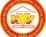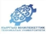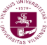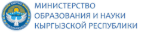

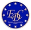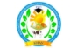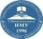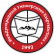

3\. Рабочие пакеты 

1. WP1. Управление проектом
1. WP2. Концептуализация и разработка PhD-платформы
1. WP3. Пилотирование цифровой среды PhD-программ
1. WP4. Распространение результатов и интеграция в политику

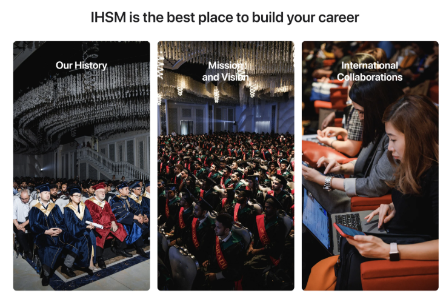

В каждом WP должны быть страницы/подстраницы с: эта информация будет и в Меню- Рабочие пакеты

1. Краткое описание Рабочего пакета с ключевыми мероприятиями
1. ответственные партнёры
1. материалами (ссылка на гул-драйв файлы, отчёты, презентации)

Консорциум как у проекта <https://esgca-erasmus.com/en/consorcium> 

Футер тоже как у проекта ESGCA, иконки на соц сети: инстаграм, фейсбук, ютуб – будут кликабельными
